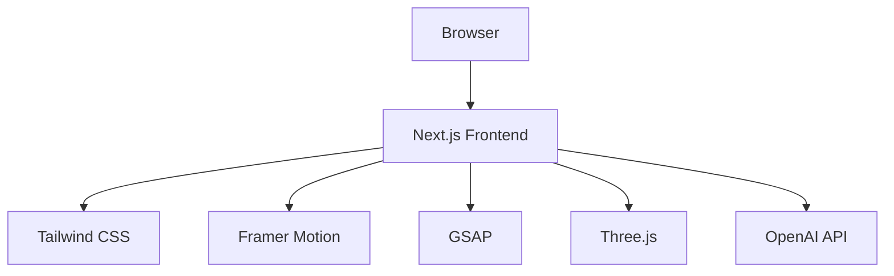

## 1. Architecture Design


## 2. Technology Description
- **Frontend**: Next.js@15 + React@18 + TypeScript
- **Styling**: Tailwind CSS@3
- **Animation**: Framer Motion + GSAP
- **3D/Visualization**: Three.js + @react-three/fiber + @react-three/drei
- **Icons**: lucide-react
- **Build Tool**: Vite

## 3. Route Definitions
| Route | Purpose |
|-------|---------|
| / | Single-page application with all 7 sections |

## 4. Component Structure
```
src/
├── components/
│   ├── Landing/
│   │   ├── index.tsx          # 首屏组件
│   │   └── ParticleBackground.tsx  # Three.js粒子背景
│   ├── Timeline/
│   │   ├── index.tsx          # 时间轴组件
│   │   └── TimelineNode.tsx   # 节点卡片组件
│   ├── SkillMap/
│   │   ├── index.tsx          # 技能网络组件
│   │   └── SkillNode.tsx      # 节点组件
│   ├── Projects/
│   │   ├── index.tsx          # 项目展示容器
│   │   ├── DailyStock.tsx     # Daily A-share Intelligence
│   │   ├── ProspectTheory.tsx # 前景理论交互组件
│   │   └── IndustryResearch.tsx # 产业链图谱
│   ├── AIPlayground/
│   │   ├── index.tsx          # AI实验场容器
│   │   ├── ToolCard.tsx       # 工具卡片
│   │   └── ChatInterface.tsx  # 对话界面
│   ├── Thinking/
│   │   ├── index.tsx          # 思考专栏容器
│   │   └── IdeaCard.tsx       # 想法卡片
│   ├── Contact/
│   │   └── index.tsx          # 终端联系组件
│   └── common/
│       ├── Navbar.tsx         # 导航栏
│       └── Footer.tsx         # 页脚
├── hooks/
│   ├── useScrollReveal.ts     # 滚动揭示动画hook
│   └── useMousePosition.ts    # 鼠标位置hook
├── utils/
│   └── constants.ts           # 常量数据
└── pages/
    └── index.tsx              # 主页面
```

## 5. Data Model

### 5.1 Timeline Data
```typescript
interface TimelineNode {
  id: string;
  title: string;
  period: string;
  icon: string;
  content: {
    summary: string;
    projects: string[];
    skills: string[];
  };
}
```

### 5.2 Skill Map Data
```typescript
interface SkillNode {
  id: string;
  label: string;
  x: number;
  y: number;
  color: string;
  connections: string[];
  content: {
    type: string;
    items: {
      title: string;
      description: string;
      link?: string;
    }[];
  };
}
```

### 5.3 Project Data
```typescript
interface Project {
  id: string;
  title: string;
  subtitle: string;
  description: string;
  githubUrl: string;
  type: 'dashboard' | 'interactive' | 'visualization';
  features: string[];
}
```

### 5.4 AI Tool Data
```typescript
interface Tool {
  id: string;
  name: string;
  description: string;
  icon: string;
  color: string;
}
```

### 5.5 Idea Data
```typescript
interface Idea {
  id: string;
  title: string;
  excerpt: string;
  date: string;
  tags: string[];
}
```

## 6. Performance Optimization
- Three.js粒子数量控制在500以内
- 使用React.memo和useMemo优化渲染
- 滚动动画使用GSAP ScrollTrigger
- 组件懒加载（条件性渲染）
- CSS动画优先于JS动画

## 7. Dependencies
| Package | Version | Purpose |
|---------|---------|---------|
| next | ^15.0.0 | 框架 |
| react | ^18.2.0 | UI库 |
| react-dom | ^18.2.0 | DOM渲染 |
| tailwindcss | ^3.4.0 | 样式 |
| framer-motion | ^11.0.0 | 动画 |
| gsap | ^3.12.0 | 滚动动画 |
| three | ^0.160.0 | 3D渲染 |
| @react-three/fiber | ^8.15.0 | React Three.js |
| @react-three/drei | ^9.90.0 | Three.js辅助 |
| lucide-react | ^0.300.0 | 图标 |
